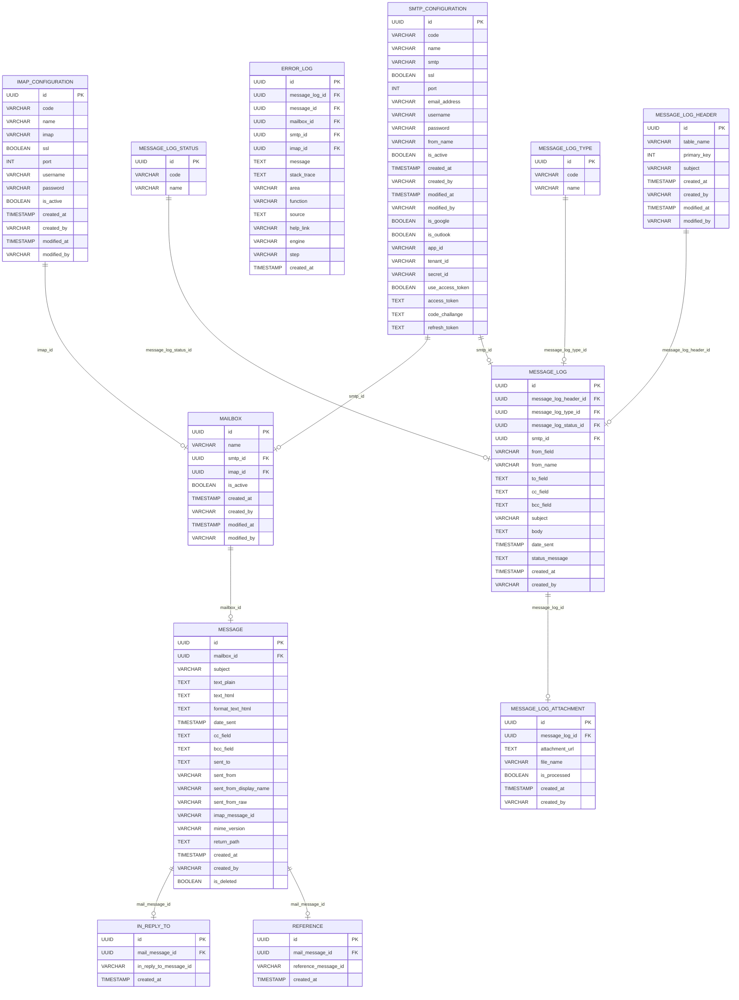

# Database Design Structure

<!--
    ERROR_LOG ||--o| MESSAGE_LOG : "message_log_id"
    ERROR_LOG ||--o| MESSAGE : "message_id"
    ERROR_LOG ||--o| MAILBOX : "mailbox_id"
    ERROR_LOG ||--o| SMTP_CONFIGURATION : "smtp_id"
    ERROR_LOG ||--o| IMAP_CONFIGURATION : "imap_id" -->
